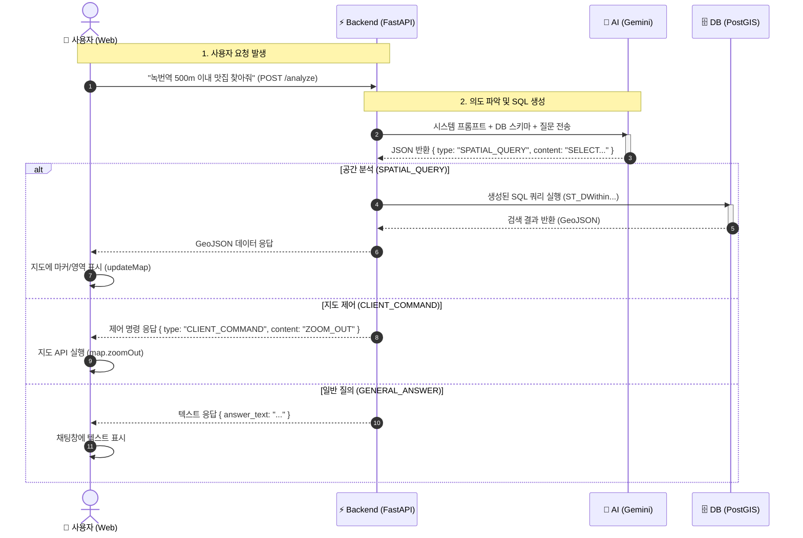

# 웹서버 문제 등으로..프로토타입 서비스를 종료합니다. 소스코드만 참조해 주십시오 ^^ (2026.01.19)   
  

🗺️ Voice-to-Map: AI 통역사 기반 FOSS4G 대시보드  

FOSS4G Korea 2025 발표 프로젝트 > 주제: "AI가 PostGIS SQL을 통역해 준다고?   
- SQL을 모르는 '아저씨'도 만든 GeoAI 대시보드"  

  
  
📖 프로젝트 소개 (About)  

이 프로젝트는 **"복잡한 공간 SQL(PostGIS)을 몰라도 누구나 자연어(음성/텍스트)로 GIS 분석을 수행할 수 없을까?"**라는 질문에서 시작되었습니다.  
LLM(Large Language Model)을 단순한 챗봇이 아닌, **사용자의 의도(Intent)를 파악하여 백엔드(DB)와 프론트엔드(Map)를 제어하는 '통역사'이자 '라우터'**로 활용하는 아키텍처를 구현했습니다.  
  

  
핵심 가치  
- No-Code GIS : ST_DWithin, ST_Buffer 같은 함수를 몰라도 "500m 이내 건물 찾아줘"라고 말하면 됩니다.  
- 기술의 민주화 : 정책 결정자, 일반 시민 등 비전문가도 FOSS4G의 강력한 기능을 활용할 수 있습니다.  
- 비용 효율성 : 오픈소스(FOSS4G) 스택과 클라우드 무료 티어(Render, GitHub Pages)를 활용하여 구축되었습니다.  
  

  
✨ 주요 기능 (Key Features)  

이 시스템은 AI가 사용자의 자연어 명령을 분석하여 다음 3가지 유형으로 자동 분류하고 실행합니다.  

   🔬 공간 분석 (Spatial Analysis)     
      - 자연어를 PostGIS SQL로 변환하여 실행  
      - 예: "녹번역 반경 250m 영역을 그리고, 그 바깥에 있는 건물만 찾아줘" (ST_Buffer, ST_DWithin, UNION ALL 활용)

   🧭 지도 제어 (Map Control)  
      - 자연어를 MapLibre API 명령으로 변환하여 실행  
      - 예: "지도 축소해줘", "3D 뷰로 보여줘" (setPitch), "위성 지도로 바꿔줘"  

   💬 일반 질의 (General QA)  
      - 데이터베이스와 관련 없는 질문에 대한 AI 답변  
      - 예: "네가 가진 데이터 목록을 알려줘"  

  
  
🏗️ 시스템 아키텍처 (Architecture)     

AI(Gemini)는 실행자가 아닙니다. 명령을 해석하고 분기하는 '두뇌' 역할을 수행합니다.  
  

## 🏗️ 시스템 시퀀스 다이어그램 (System Flow)

  

🛠️ 기술 스택 (Tech Stack)    
구분    -    기술 (Stack)    -    역할  
Frontend    -    MapLibre GL JS    -    오픈소스 지도 시각화 및 사용자 인터랙션   
Hosting (FE)    -    GitHub Pages    -    정적 웹 호스팅 (무료)  
Backend    -    Python FastAPIAPI    -    서버, AI-DB 중계 로직  
Hosting (BE)    -    Render.com    -    웹 서비스 호스팅   
Database    -    PostgreSQL + PostGIS    -    공간 데이터 저장 및 분석 엔진  
Hosting (DB)    -    Render.com    -    관리형 DB 호스팅   
AI Engine    -    Google Gemini 1.5 Flash    -    자연어 의도 분석 및 SQL/명령 생성  

🚀 설치 및 실행 방법 (Getting Started)  
1. 사전 준비 (Prerequisites)  
   - Python 3.11 이상  
   - Google Gemini API Key  
   - MapTiler API Key (배경지도용)  
   - PostgreSQL + PostGIS (로컬 또는 클라우드)  
  
2. 로컬 실행 (Local Development)  
   - 저장소 클론:  
    git clone https://github.com/thlee33/ai_sql_map.git  
    cd ai_sql_map  
  
   - 필요한 패키지 설치  
    pip install -r requirements.txt  
  
   - .env 파일 생성  
    GOOGLE_API_KEY="your_gemini_api_key"  
    DB_HOST="localhost"  
    DB_PORT="5432"  
    DB_NAME="your_db_name"  
    DB_USER="your_db_user"  
    DB_PASS="your_db_password"  
  
    - 백엔드 서버 실행:  
      uvicorn main:app --reload  
  
    - 프론트엔드 실행:  
      : index.html 파일을 Live Server 등으로 실행하거나 브라우저에서 직접 엽니다.  
      : (index.html 내의 backendUrl을 http://127.0.0.1:8000/analyze로 맞춰야 함)  
  

  
📂 데이터셋 (Sample Data)  
본 프로젝트는 서울시 데이터를 샘플로 사용합니다. (출처: 국가공간정보포털, 서울 열린데이터광장)   
- buildings (bldg_pt): 건물 포인트 (준공연도, 용도 포함)  
- subway_stations (subway_pt): 지하철역 포인트  
- restaurants (restaurants): 음식점 인허가 정보 (한식, 중식, 카페 등)  

  
  
🎤 발표 자료 (Presentation)  
FOSS4G Korea 2025에서 발표한 슬라이드 자료입니다.  

📜 LicenseThis project is licensed under the MIT License   

Contact: geodata357@gmail.com / 이동훈   
